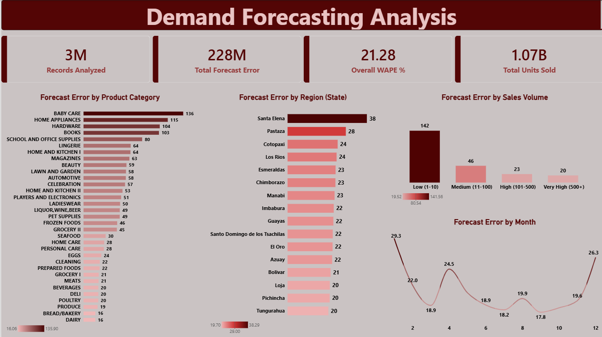

# 📦 Demand Forecasting Analysis

**One-line summary:** A look at nearly 3 million daily product-level sales forecasts to find out exactly where demand predictions go wrong the most — by product category, region, and sales volume — so a supply chain team knows where to focus on improving forecasts first.

## Overview

This project looks at real daily sales data from a supermarket chain to answer a simple question: when we try to predict how much of a product will sell, where are we getting it wrong, and by how much? Using Python, SQL (MySQL), and Power BI, the raw sales data was cleaned, a simple forecast was built, the forecast's errors were measured, and everything was turned into an easy-to-read dashboard that shows exactly where forecasting breaks down the most.

## Problem Statement

**The question this project answers:** Which product categories, which regions, and which sales-volume groups have the least reliable demand forecasts — and where should a supply chain team focus first to improve accuracy?

A quick note on approach: this project doesn't use a complex machine learning model to predict sales. Instead, it builds a simple "naive" forecast — predicting that a product will sell the same amount today as it did exactly one week ago — and then measures how wrong that forecast turns out to be. This naive forecast acts as a baseline: a simple, honest starting point that shows where forecasting is naturally hard, before any fancy modeling is layered on top.

## Dataset

| | |
|---|---|
| Source | [Store Sales – Time Series Forecasting dataset on Kaggle](https://www.kaggle.com/competitions/store-sales-time-series-forecasting) — real sales data from Corporación Favorita, a large Ecuadorian supermarket chain |
| Size | About 3 million rows, covering 54 stores, 33 product categories, and multiple regions across Ecuador |
| Time period | Several years of daily sales history |
| What was used | Daily sales by store and product category, plus store details (city, state, store type) and holiday/event dates |

## Tools & Technologies

- **Python** — cleaned the raw data and built the baseline forecast
- **MySQL** — organized the data and calculated forecast error
- **Power BI** — built the final dashboard
- **Jupyter Notebook** — where the Python work was done

## Methods

1. **Python:** Opened the raw sales data, cleaned it, and built a simple baseline forecast — for every store and product, predicting that today's sales would match the sales from exactly 7 days earlier. Then calculated how far off that forecast was from the actual sales, for every single row.
2. **MySQL:** Loaded the cleaned data into a database, then calculated **WAPE (Weighted Absolute Percentage Error)** — a way of measuring forecast accuracy that works even when many products sell zero units on a given day (a simple percentage error can't be calculated when the actual sales are zero, so WAPE adds everything up first before comparing). Used this to measure error by product category, by region, by sales volume (low, medium, high), and by month.
3. **Power BI:** Brought all of that together into a dashboard with summary numbers and charts showing exactly which categories, regions, and volume groups have the highest forecast error.

## Key Insights

**Overall accuracy**

- 2,988,414 store-and-product combinations were analyzed.
- Across all of them, the baseline forecast was off by **21.28%** on average (WAPE) — meaning predicted sales typically differed from actual sales by about a fifth.
- In raw numbers: actual sales totaled about 1.07 billion units, and the forecast was off by about 228 million units in total.

**Error by product category**

Some categories are much harder to predict than others. Baby Care had the highest error (136%), followed by Home Appliances (115%), Hardware (104%), and Books (103%) — these are likely products people buy irregularly, making "same as last week" a poor guess. On the other end, Dairy (16%) and Bread/Bakery (16%) had the lowest error — these are everyday staples people buy on a steady, predictable schedule.

**Error by region**

Santa Elena had the highest forecast error (38%), followed by Pastaza (28%). Most other regions clustered between 20–24%, with Tungurahua the most predictable (20%). This suggests certain regions have more irregular buying patterns than others, possibly due to smaller store sizes or more seasonal/tourist-driven shopping.

**Error by sales volume**

This is one of the clearest patterns in the whole project: low-volume products had by far the highest error (142%), dropping sharply as volume increased — medium-volume products (46%), high-volume (23%), and very-high-volume products were the most predictable of all (20%). This makes intuitive sense: when a product only sells a handful of units a day, a swing of just 2–3 units looks like a huge percentage change, while high-volume staples average out and stay much more stable day to day.

**Error by month**

Forecast error wasn't steady throughout the year — it spiked in January (29.3%) and climbed again in December (26.3%), with the calmest months sitting in the high teens to low twenties. This lines up with the holiday season: a forecast that simply assumes "same as last week" has no way of knowing a holiday is coming, so it consistently underpredicts or overpredicts around those spikes.

## Dashboard

The Power BI dashboard includes:

- Four summary cards: total records analyzed, total forecast error, total units sold, and the overall WAPE accuracy rate
- A bar chart showing forecast error by product category
- A bar chart showing forecast error by region
- A bar chart showing forecast error by sales volume group
- A line chart showing forecast error by month

Each bar chart is shaded from dark to light based on error size, so the highest-error categories, regions, and volume groups stand out at a glance.

## How to Run This Project

1. Download the dataset from the [Kaggle competition page](https://www.kaggle.com/competitions/store-sales-time-series-forecasting) and place the files in a `Data` folder.
2. Open `Demand_Forecasting_Analysis.ipynb` in Jupyter Notebook and run it from top to bottom. This cleans the data, builds the baseline forecast, and saves the results into the `Exports` folder.
3. Create a MySQL database and run the queries in `Demand_Forecasting_Analysis.sql` to calculate the WAPE breakdowns.
4. Open `Demand_Forecasting_Analysis_Dashboard.pbix` in Power BI Desktop to see the finished dashboard.

## Results & Conclusion

Overall, a simple "same as last week" forecast misses the mark by about 21% on average — but that error is far from evenly spread. It's worst for low-volume, irregularly-bought products (like Baby Care and Home Appliances), and worst during the holiday season (January and December), when a forecast with no awareness of holidays is bound to be caught off guard. It's most accurate for everyday staples that sell in high volume and on a steady schedule, like Dairy and Bread. For a supply chain team, this points clearly to where a smarter forecasting approach — one that accounts for holidays and low-volume product behavior — would make the biggest difference, rather than trying to improve accuracy everywhere equally.

## Limitations

- **Baseline forecast only:** this project uses a simple "same as last week" forecast to measure where errors happen, not a trained machine learning model built to minimize error. The goal here was to find and explain the error patterns, not to produce the most accurate forecast possible.
- **WAPE instead of simple percentage error:** about 31% of rows have zero actual sales, which makes a basic percentage error impossible to calculate (you can't divide by zero). WAPE avoids this by summing all the errors and all the sales first, then comparing the totals.
- **Minor rounding:** sales values with extra decimal places (for items sold by weight) were rounded slightly when loaded into the database — this doesn't meaningfully affect the results, since it was confirmed no rows were lost in the process.
- **No live external factors:** the dataset includes oil prices and promotion flags, but this project focused on category, region, volume, and seasonal patterns rather than building those extra signals into the forecast itself.

## Author & Contact

**Simerpreet Kaur** 
Data Analyst 
📧 Email: ksimerpreet3@gmail.com 
🔗 LinkedIn: [linkedin.com/in/simer-preet-kaur](https://www.linkedin.com/in/simer-preet-kaur/) 
🔗 GitHub: [github.com/Simer45](https://github.com/Simer45)
